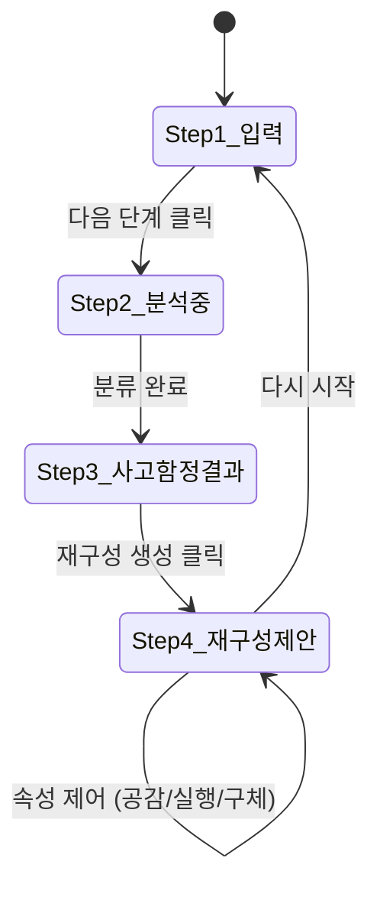
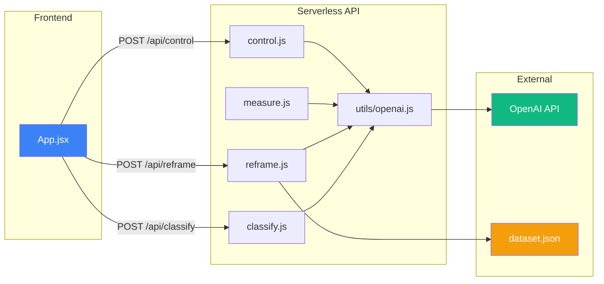

# 📁 프로젝트 구조 및 코드 해설

> **Cognitive Reframing** - 부정적인 생각을 건강한 관점으로 변환하는 AI 기반 인지 재구성 도구

---

## 📂 디렉토리 구조

```
cognitive-reframing/
├── .env                          # 환경 변수 (OPENAI_API_KEY)
├── .gitignore
├── README.md                     # 프로젝트 소개
├── ARCHITECTURE.md               # 📌 이 문서 (구조 및 코드 해설)
│
├── data/
│   └── reframing_dataset.csv     # 원본 학습 데이터 (600개 전문가 레이블)
│
└── frontend/                     # 🎯 메인 애플리케이션 (Vite + React)
    ├── index.html                # HTML 진입점
    ├── package.json              # 의존성 및 스크립트 정의
    ├── vite.config.js            # Vite 빌드 설정
    ├── eslint.config.js          # ESLint 코드 품질 설정
    │
    ├── api/                      # 🔌 Vercel Serverless Functions (백엔드)
    │   ├── utils/
    │   │   └── openai.js         # OpenAI 클라이언트 초기화 & 모델 상수
    │   ├── classify.js           # 사고함정 분류 API
    │   ├── reframe.js            # 인지 재구성 생성 API
    │   ├── measure.js            # 재구성 품질 측정 API
    │   └── control.js            # 재구성 속성 제어 API
    │
    ├── src/                      # 🖥️ 프론트엔드 소스
    │   ├── main.jsx              # React 앱 진입점
    │   ├── App.jsx               # 메인 UI 컴포넌트 (전체 화면 구성)
    │   └── assets/               # 정적 리소스
    │
    └── public/
        └── vite.svg              # 파비콘
```

---

## ⚙️ 기술 스택 상세

| 영역 | 기술 | 버전 | 용도 |
|------|------|------|------|
| 프론트엔드 | React | 19.2 | SPA UI 렌더링 |
| 빌드 도구 | Vite | 8.0 beta | 개발 서버 & 번들링 |
| HTTP 클라이언트 | Axios | 1.13 | API 요청 |
| 백엔드 | Vercel Serverless | - | API 엔드포인트 호스팅 |
| AI/ML | OpenAI API | 4.85 | GPT-4o-mini(텍스트), text-embedding-3-small(임베딩) |
| 유사도 검색 | string-similarity | 4.0 | 문자열 유사도 기반 사례 검색 |

---

## 🔌 API 엔드포인트 상세

### `api/utils/openai.js` — 공통 유틸리티

OpenAI 클라이언트를 초기화하고, 모든 API에서 공유하는 모델 상수를 정의합니다.

| 내보내기 | 값 | 설명 |
|----------|-----|------|
| `openai` | OpenAI 인스턴스 | `process.env.OPENAI_API_KEY`로 초기화 |
| `GPT_MODEL` | `gpt-4o-mini` | 텍스트 생성용 모델 |
| `EMBEDDING_MODEL` | `text-embedding-3-small` | 임베딩 벡터 생성용 모델 |

---

### 1. `POST /api/classify` — 사고함정 분류

**역할**: 사용자의 부정적인 생각이 어떤 인지 왜곡(사고함정)에 해당하는지 분류합니다.

**요청 바디**:
```json
{
  "thought": "나는 절대 성공하지 못할 거야",
  "situation": "프로젝트 발표가 잘 안됐다"
}
```

**동작 원리**:
1. Few-shot 프롬프트를 구성하여 5가지 예시(Mind Reading, Fortune Telling, Labeling, All-or-Nothing, Catastrophizing)를 제공
2. GPT-4o-mini에게 사용자의 생각이 어떤 왜곡 유형인지 분류 요청
3. `top_p: 0.6`으로 결정적인 응답 유도

**응답**:
```json
{ "thinking_trap": "Fortune Telling (90%)" }
```

---

### 2. `POST /api/reframe` — 인지 재구성 생성

**역할**: 유사한 치료 사례를 검색(Retrieval)하고, 이를 활용해 3가지 재구성 문장을 생성합니다.

**요청 바디**:
```json
{
  "thought": "나는 절대 성공하지 못할 거야",
  "situation": "프로젝트 발표가 잘 안됐다",
  "k": 5
}
```

**동작 원리** (2단계 Retrieval-Augmented Generation):

```
사용자 입력 → [1] 유사 사례 검색 → [2] 프롬프트 구성 → [3] GPT 생성 (×3)
```

1. **검색(Retrieval)**: `data/dataset.json`에서 `string-similarity` 라이브러리로 상위 K개 유사 사례를 찾음
2. **셔플**: 검색된 사례를 무작위로 섞어 편향 방지
3. **생성(Generation)**: 유사 사례들을 Few-shot 예시로 포함한 프롬프트를 구성하고, `Promise.all`로 3개의 재구성 문장을 **병렬 생성**

**응답**:
```json
{
  "reframes": ["재구성 1", "재구성 2", "재구성 3"],
  "similar_cases": [{ "thought": "...", "situation": "...", "reframe": "..." }],
  "retrieved_k": 5
}
```

---

### 3. `POST /api/measure` — 재구성 품질 측정

**역할**: 생성된 재구성 문장의 품질을 4가지 속성으로 측정합니다.

**요청 바디**:
```json
{
  "reframe": "재구성된 문장",
  "thought": "원래 부정적 생각",
  "situation": "상황 설명"
}
```

**측정 속성**:

| 속성 | 측정 방법 | 범위 |
|------|----------|------|
| **구체성 (specificity)** | OpenAI 임베딩 → 코사인 유사도 (재구성 ↔ 원문 맥락) | 0~1 |
| **실행 가능성 (actionability)** | 행동 키워드 패턴 매칭 (`can`, `try`, `해보자` 등) | 0~1 |
| **공감도 (empathy)** | 공감 키워드 패턴 매칭 (`understand`, `괜찮` 등) | 0~1 |
| **긍정성 (positivity)** | 긍정 키워드 패턴 매칭 (`good`, `성장` 등) | 0~1 |

**응답**:
```json
{
  "specificity": 0.823,
  "actionability": 0.667,
  "empathy": 0.333,
  "positivity": 0.500
}
```

---

### 4. `POST /api/control` — 재구성 속성 제어

**역할**: 선택한 재구성 문장의 특정 속성(공감, 실행 가능성, 구체성)을 강화합니다.

**요청 바디**:
```json
{
  "reframe": "기존 재구성 문장",
  "attribute": "empathy",
  "thought": "원래 생각",
  "situation": "상황"
}
```

**지원 속성**:
- `empathy` → 더 공감적이고 감정을 인정하는 문장으로 재작성
- `actionability` → 구체적 행동 단계를 포함하도록 재작성
- `specificity` → 특정 상황에 맞춤화하여 재작성

**응답**:
```json
{ "controlled_reframe": "개선된 재구성 문장" }
```

---

## 🖥️ 프론트엔드 (`App.jsx`) 흐름

React의 `useState`로 4단계 스텝 기반 UI를 구현합니다.



### 각 단계 설명

| 단계 | 화면 | 호출 API |
|------|------|----------|
| **Step 1** | 부정적 생각 + 상황 입력 폼 | - |
| **Step 2** | 로딩 인디케이터 (분석 중) | `POST /api/classify` |
| **Step 3** | 감지된 사고함정 표시 + 사용자 입력 요약 | - |
| **Step 4** | 3개 재구성 제안 카드 + 속성 제어 버튼 | `POST /api/reframe`, `POST /api/control` |

### 주요 상태 변수

| 변수 | 타입 | 용도 |
|------|------|------|
| `step` | number (1~4) | 현재 UI 단계 |
| `thought` | string | 사용자의 부정적 생각 |
| `situation` | string | 상황 설명 |
| `thinkingTrap` | string | 분류된 사고함정 결과 |
| `reframes` | string[] | 3개의 재구성 제안 |
| `selectedReframe` | string | 사용자가 선택한 재구성 |
| `similarCases` | object[] | 검색된 유사 치료 사례 |
| `loading` | boolean | API 호출 중 여부 |
| `error` | string | 에러 메시지 |

---

## 📊 데이터

### `data/reframing_dataset.csv`

ACL 2023 논문의 전문가 레이블 데이터셋(~600개). 각 행은 다음 필드를 포함합니다:
- **situation**: 부정적 생각이 발생한 상황
- **thought**: 왜곡된 부정적 생각
- **reframe**: 전문가가 작성한 인지 재구성 문장

> 이 CSV가 서버리스 환경에서 사용되려면 JSON으로 변환된 `frontend/data/dataset.json`이 필요합니다.
> `reframe.js`가 이 JSON 파일을 읽어 유사 사례 검색에 활용합니다.

---

## 🚀 로컬 개발 vs 배포

### 로컬 개발
```bash
cd frontend
npm install
npm run dev        # Vite 개발 서버 (HMR 지원)
```
> ⚠️ 로컬에서는 Serverless Functions가 작동하지 않으므로 `vercel dev` 명령을 사용해야 합니다.

### Vercel 배포
1. Root Directory = `frontend`
2. `OPENAI_API_KEY` 환경 변수 설정
3. `api/` 폴더가 자동으로 Serverless Functions로 배포됨

---

## 🔗 핵심 의존성 관계


